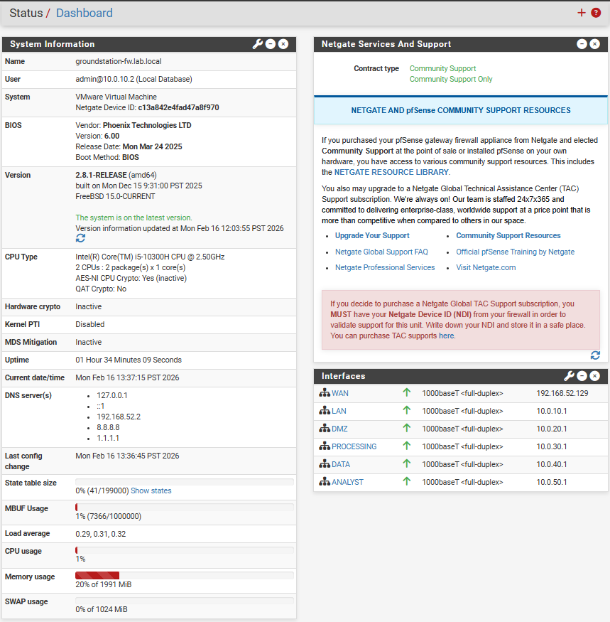
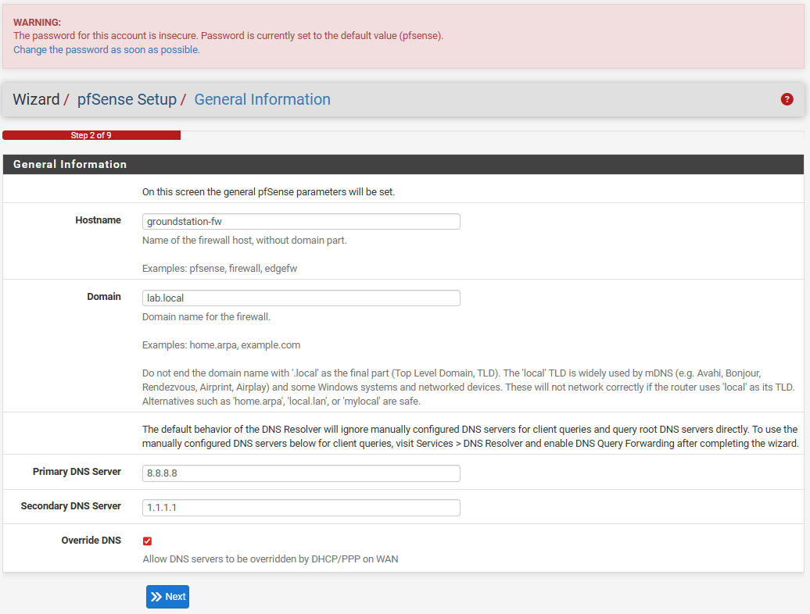
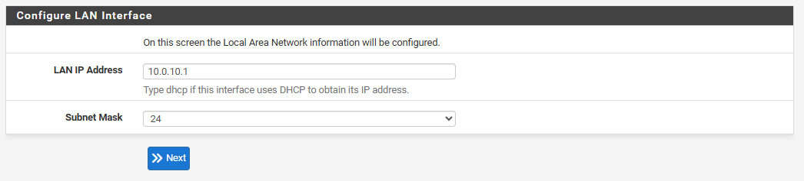
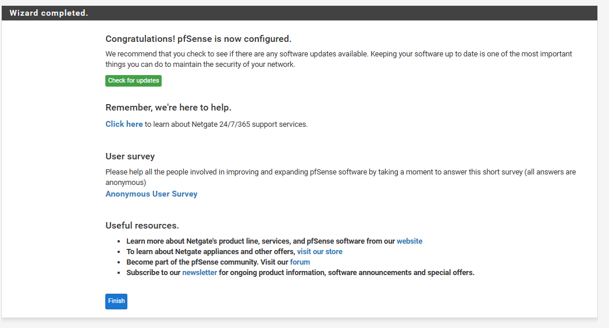

# 06 – Security Validation Report

## 1. Objective

This report documents validation activities performed to verify implementation of defined security requirements for the Secure Ground Station Architecture (Mk1).

---

## 2. Infrastructure Build & Baseline Configuration

### 2.1 Firewall Deployment

pfSense was deployed as the central segmentation enforcement point with multiple interfaces mapped to distinct security zones.

### 2.2 Baseline Configuration Controls

DNS, NTP, and interface configuration were verified.

