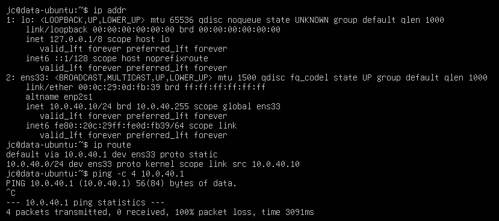
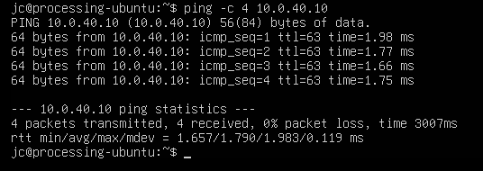
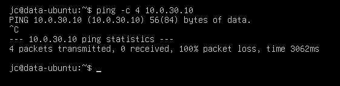
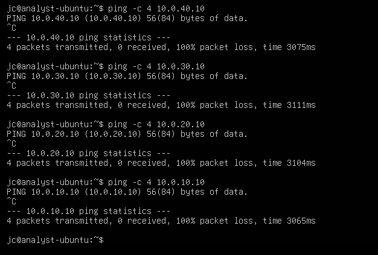
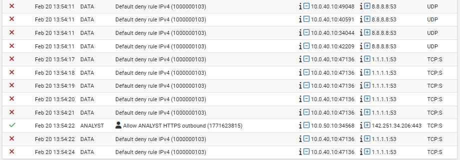

---

## 3. Network Segmentation Validation

### 3.1 Baseline Routing Verification

Each zone was validated to confirm correct IP configuration, default gateway assignment, and intended north-south connectivity prior to segmentation enforcement.

#### Processing Zone Baseline

#### Data Zone Baseline (Pre-Isolation)

---

## 3.2 DATA Tier Strict Isolation Enforcement

The DATA zone was hardened using a default-deny policy with no outbound rules configured.

### DATA Default-Deny Verification

Validation Result:
- DATA → Internet: Blocked
- DATA → Gateway: Blocked
- DATA → Processing: Blocked

This confirms enforcement of SR-05 (default deny) and SR-02 (restricted inter-zone communication).

---

## 3.3 Controlled East-West Traffic (Processing → Data)

A targeted allow rule was implemented on the PROCESSING interface to permit controlled access to the DATA host.

### Processing → Data Allowed

### Data → Processing Blocked

Validation Result:
- Processing → Data: Allowed
- Data → Processing: Blocked

This demonstrates directional enforcement and least privilege network design.

---

## 3.4 Analyst Zone Egress Control

The ANALYST zone was configured with a strict default-deny posture and selective HTTPS egress capability.

### Analyst Default Deny

### Analyst HTTPS Allowed

Validation Result:
- ICMP outbound: Blocked
- Direct access to internal zones: Blocked
- HTTPS outbound: Allowed

This demonstrates protocol-level traffic control aligned with least privilege principles.

---

## 3.5 Firewall Logging and Auditability

Logging was enabled on both pass and block rules to validate enforcement visibility.

Observed in logs:
- Default deny events on DATA interface (DNS attempts blocked)
- Successful Analyst HTTPS sessions
- Controlled Processing → Data traffic

This supports:
- SR-15: Security event logging
- SR-16: Centralized monitoring capability
- SR-05: Explicit deny enforcement

---

## 4. Summary of Validated Controls

| Control Objective | Validation Outcome |
|-------------------|-------------------|
| Zone Segmentation | Implemented and verified |
| Default Deny Policy | Enforced across all zones |
| DATA Strict Isolation | Confirmed |
| Controlled Processing Access | Confirmed |
| Analyst Controlled Egress | Confirmed |
| Firewall Logging | Enabled and validated |

---

## 5. Conclusion

The Secure Ground Station Mk1 architecture successfully demonstrates:

- Multi-tier segmentation
- Strict inter-zone traffic control
- Directional access enforcement
- Hardened data enclave design
- Controlled analyst egress
- Logged and auditable policy enforcement

The system meets defined security requirements (SR-01 through SR-16) and demonstrates secure systems engineering practices aligned with enterprise and mission-critical infrastructure environments.
