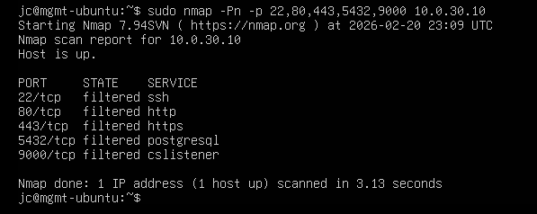
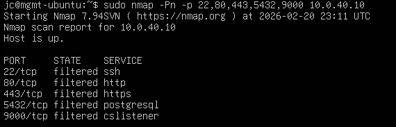
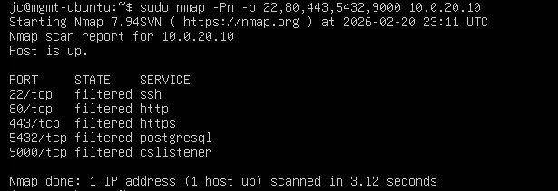

# 07 – Vulnerability Scan Summary

## 1. Objective

This assessment validates that only intended services are exposed within each security zone and that segmentation controls effectively restrict unauthorized access between zones.

This scan supports validation of the following requirements:

- SR-05 (Default deny posture)
- SR-06 (Restricted east-west traffic)
- SR-12 (Data zone isolation)
- R3 (DMZ pivot prevention)
- R4 (Unauthorized internal access prevention)

---

## 2. Scope

### Target Hosts

| Zone        | IP Address     |
|------------|---------------|
| Processing | 10.0.30.10     |
| Data       | 10.0.40.10     |
| DMZ        | 10.0.20.10     |

### Scanning Host

Management Jump Host  
IP: 10.0.10.10

---

## 3. Tool & Methodology

Tool: Nmap 7.94SVN  
Scan Type: TCP SYN scan (restricted port scan)

Command Used:

sudo nmap -Pn -p 22,80,443,5432,9000 <target_ip>

Port selection rationale:

22 (SSH)

80 (HTTP)

443 (HTTPS)

5432 (PostgreSQL)

9000 (MinIO / object storage)

ICMP was restricted in several zones; therefore, the -Pn option was used to bypass host discovery and treat the host as online.

## 4. Results
4.1 Processing Zone (10.0.30.10)

All tested ports were reported as filtered.

Conclusion:

No unintended services are exposed from the Processing zone. Access is restricted to explicitly defined traffic flows.

4.2 Data Zone (10.0.40.10)

All tested ports were reported as filtered.

Conclusion:

Data storage services are not externally accessible and are reachable only through explicitly permitted internal flows.

4.3 DMZ Zone (10.0.20.10)

All tested ports were reported as filtered from the Management network.

Conclusion:

The DMZ host does not expose services to the Management network unless explicitly permitted.

## 5. Risk Evaluation

No unintended open services were identified during scanning.

Residual Risk: Low
Segmentation Effectiveness: Validated

## 6. Security Control Validation

This scan confirms:

Default deny enforcement

Strict zone-based segmentation

No unintended lateral movement exposure

Controlled management access

Proper implementation of trust boundaries

## 7. Summary

The vulnerability scan confirms that the Secure Ground Station architecture enforces strong segmentation controls and exposes no unintended services across security zones.

This validates the effectiveness of the firewall configuration and supports the overall threat risk assessment conclusions.
